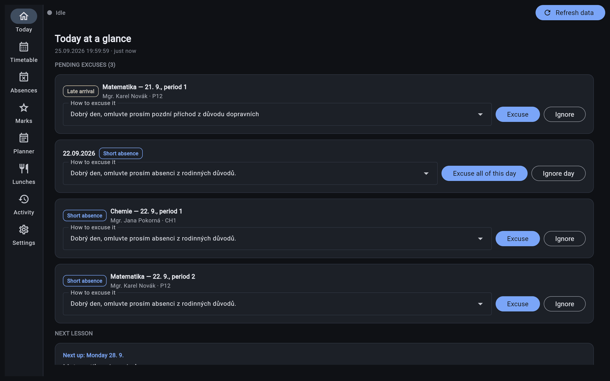
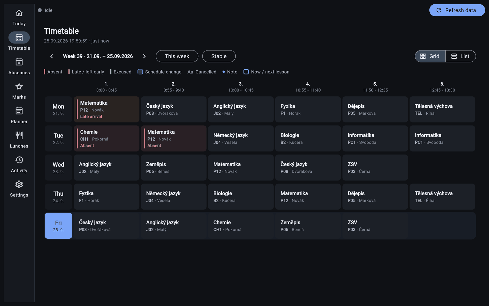
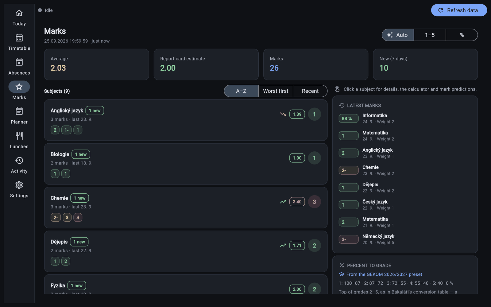
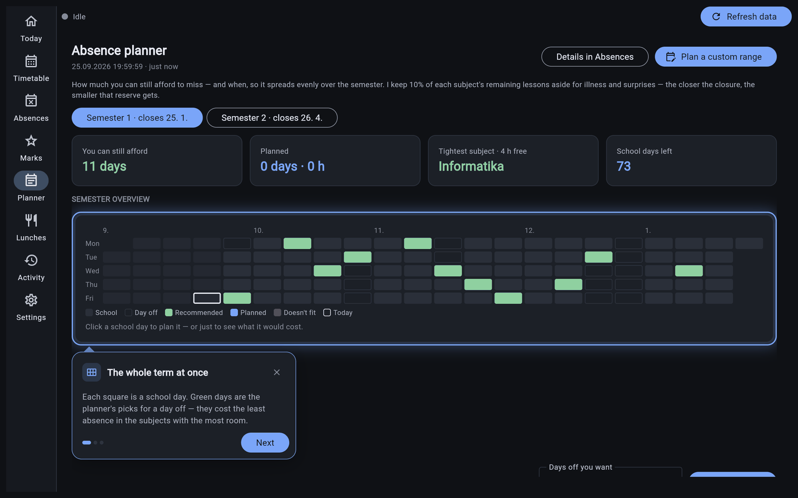
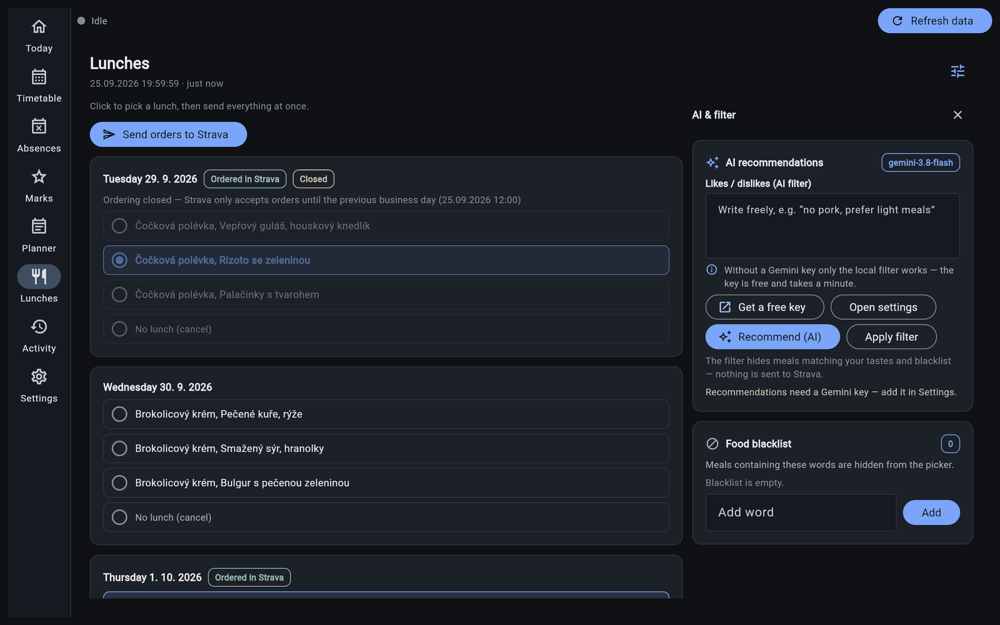

#  Strakaláři

**Excuses in Bakaláři and lunches on Strava — handled for you.**
A free app for students on Windows, macOS and Linux. No coding: download it and run it.

**[⬇️ Download the latest version](https://github.com/DeNdlerX/strakalari/releases)** · [Česká verze](README.md)

> ⚠️ **Read before use.** Strakaláři is an independent student project, not affiliated with Bakaláři or Strava. It acts **under your own account**: the excuses and orders it sends are yours, and a sent excuse cannot be taken back. Use it only with your own account and only as your school's rules allow. No warranty — see [License & Disclaimer](#license--disclaimer).

---

## Install

1. Open **[Releases](https://github.com/DeNdlerX/strakalari/releases)** and download the file for your system:

   | System | File | What to do |
   |---|---|---|
   | **Windows** | `Strakalari-Setup-<version>.exe` | Run the installer. No administrator rights needed. |
   | **macOS** | `Strakalari-<version>.dmg` | Drag the app into Applications. |
   | **Linux** | `Strakalari-<version>-x86_64.AppImage` | Allow executing it in the file's properties, then run it. |

2. Launch Strakaláři. A **setup wizard** walks you through your Bakaláři and Strava logins and the basic settings. Meanwhile the app downloads Chrome once (about 320 MB), which it uses to work with the websites.
3. Done. The first time you open each screen, a short **interactive tutorial** shows you around.

> **Windows says "Windows protected your PC"?** The app has no paid code-signing certificate. Click *More info → Run anyway*, but only for a file you downloaded from the Releases page above. To double-check the download, compare it against `SHA256SUMS.txt` on the release.

## Updating

When a new version comes out, the app tells you. Download the new installer from [Releases](https://github.com/DeNdlerX/strakalari/releases) and run it over your current install. **Your settings, passwords and history are kept.** There is no need to uninstall first.

Want test versions before everyone else? Switch the update channel to **Beta** in *Settings → Diagnostics*.

---

## What it does

- **Today** — pending excuses, sent with one click: late arrivals, early leaves, single lessons and whole days (pictured above).
- **Timetable** — the week as in Bakaláři, with absences, substitutions, cancelled lessons and rooms.
- **Absences** — the percentage for every subject, with a warning before you go over the limit.
- **Marks** — weighted averages, a report-card estimate, "what do I need on the next test" and "what if" predictions.
- **Planner** — how many days you can still afford to miss, and when, spread evenly up to the absence closure.
- **Lunches** — the weekly menu, ordering everything at once, an ingredient blacklist and optional AI recommendations.

| Timetable | Marks |
|---|---|
|  |  |
| **Planner** (with an interactive tutorial) | **Lunches** |
|  |  |

Screenshots use made-up sample data.

Also:

- **Background automation** — the app can sit in the system tray, check Bakaláři and Strava regularly and (if you allow it) excuse and order on its own.
- **Interactive tutorials** — short bubbles guide you through everything you meet for the first time. Replay them in *Settings → Appearance → Replay tutorials*.
- **Czech and English**, light and dark theme.

### Nothing is sent behind your back

- The default mode is **Ask me first**: the app asks before every excuse and every order.
- **Dry run** only shows what would happen. Try it before you switch to **Automatic**.
- The **Pause automation** switch (Activity, Settings, tray icon) stops everything at once.
- The **Activity** screen lists every excuse and order, failed ones included. Errors never go silent.

---

## Supported schools

- **Bakaláři:** any school with the Bakaláři web interface. **Strava.cz:** any canteen.
- The **school calendar** (holidays, absence closures, lunch order deadline, percent-to-grade conversion) currently has a ready-made preset for:

  | School | School year |
  |---|---|
  | **GEKOM** | 2026/2027 |

  At another school? Choose **Custom days** in the wizard (or in *Settings → School calendar*) and enter your school's dates. Everything else works the same.
- **Want a preset for your school?** Send a link to the school calendar as an [issue](https://github.com/DeNdlerX/strakalari/issues/new), or add it yourself following [docs/SCHOOL_PRESETS.md](docs/SCHOOL_PRESETS.md).

---

## Something broken?

The app reads the Bakaláři and Strava websites, so any redesign on their side can break it. When that happens, please tell us **and include the log** — without it a bug is nearly impossible to find.

1. Open **Activity → Live log** and click **Copy log**. Every error dialog has the same button.
   The copied log has **passwords, usernames and your signature removed**, so you can paste it as is.
2. Open a **[new issue](https://github.com/DeNdlerX/strakalari/issues/new)** with:
   - the app version (shown in *Activity* and in *Settings → Diagnostics*),
   - your system (Windows / macOS / Linux),
   - what you did, what happened and what you expected,
   - and the **copied log**.

Where are the full log files?

If the app does not start at all, attach `log.txt` and `console.log`. They are in the app's data folder:

| System | Folder |
|---|---|
| Windows | `%LOCALAPPDATA%\Programs\Strakalari` |
| macOS | `~/Library/Application Support/Strakalari` |
| Linux | `~/.config/strakalari` |

These files are not scrubbed, so look them over before you send them.

## Privacy

Everything stays on your computer. The app sends your details only to your school's Bakaláři and to Strava, and to Google Gemini only if you turn on AI recommendations yourself. The author has no access to your data. Passwords are stored encrypted, with the key held by your system's credential store.

---

## License & Disclaimer

Distributed under the **GNU General Public License v3 (GPLv3)** — see [`LICENSE`](LICENSE).

Strakaláři is not affiliated with, endorsed by or supported by the makers of Bakaláři or Strava.cz. Use the software only with your own accounts, and only as your school's rules, the terms of use of Bakaláři and Strava.cz, and applicable laws allow. It is your responsibility to check them. Everything the app sends is sent under your account. The software is provided without any warranty, and the author **is not responsible** for any damage or issues caused by it. Use at your own risk.

## For developers

Building from source, tests, the project layout and contribution rules are in **[CONTRIBUTING.md](CONTRIBUTING.md)**.
