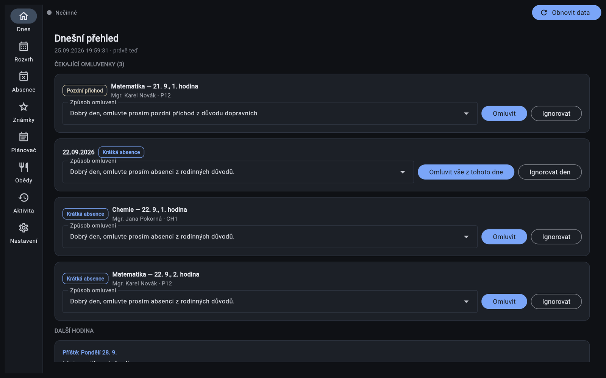
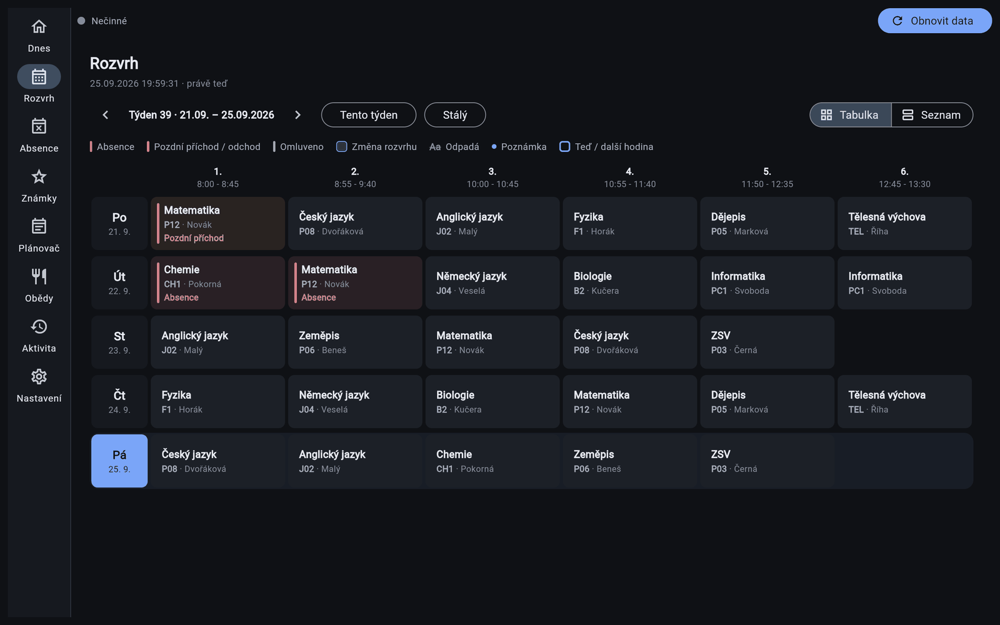
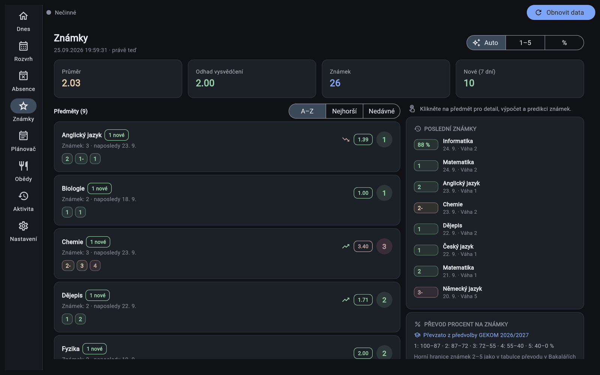
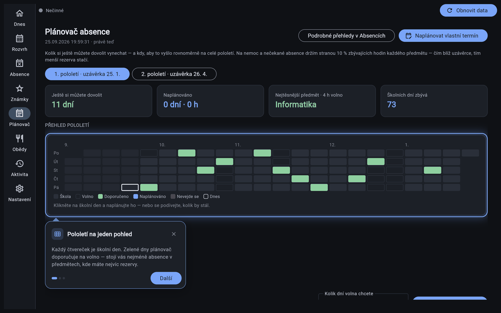
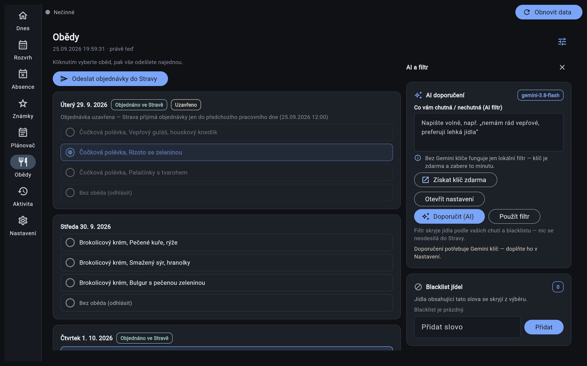

#  Strakaláři

**Omluvenky do Bakalářů a obědy ve Stravě — samy, bez hlídání.**
Bezplatná aplikace pro studenty na Windows, macOS a Linux. Nic neprogramujete, jen stáhnete a spustíte.

**[⬇️ Stáhnout nejnovější verzi](https://github.com/DeNdlerX/strakalari/releases)** · [English version](README.en.md)

> ⚠️ **Před použitím si přečtěte.** Strakaláři je nezávislý studentský projekt bez vazby na Bakaláře ani Stravu. Jedná **pod vaším vlastním účtem**: omluvenky i objednávky jsou vaše a odeslanou omluvenku nelze vzít zpět. Používejte ji jen se svým účtem a jen tak, jak to dovolují pravidla vaší školy. Bez záruky — viz [Licence a odpovědnost](#licence-a-odpovědnost).

---

## Instalace

1. Otevřete **[Releases](https://github.com/DeNdlerX/strakalari/releases)** a stáhněte soubor pro svůj systém:

   | Systém | Soubor | Co s ním |
   |---|---|---|
   | **Windows** | `Strakalari-Setup-<verze>.exe` | Spusťte instalátor. Administrátor není potřeba. |
   | **macOS** | `Strakalari-<verze>.dmg` | Přetáhněte aplikaci do složky Aplikace. |
   | **Linux** | `Strakalari-<verze>-x86_64.AppImage` | Ve vlastnostech souboru povolte spouštění a spusťte ho. |

2. Spusťte Strakaláře. **Průvodce** vás provede přihlášením do Bakalářů a Stravy a základním nastavením. Mezitím si aplikace jednorázově stáhne Chrome (asi 320 MB), přes který s weby pracuje.
3. Hotovo. Při prvním pohledu na každou obrazovku vám krátký **interaktivní návod** ukáže, co kde je.

> **Windows hlásí „Systém Windows ochránil váš počítač“?** Aplikace nemá placený podpisový certifikát. Klikněte na *Další informace → Přesto spustit*, ale jen u souboru staženého ze stránky Releases výše.

## Aktualizace

Když vyjde nová verze, aplikace vám to sama oznámí. Stáhněte nový instalátor ze stránky [Releases](https://github.com/DeNdlerX/strakalari/releases) a spusťte ho přes stávající instalaci. **Nastavení, hesla i historie zůstanou.** Nic nemusíte odinstalovávat.

Chcete dostávat i testovací verze dřív než ostatní? V *Nastavení → Diagnostika* přepněte kanál aktualizací na **Beta**.

---

## Co umí

- **Dnes** — čekající omluvenky a omluvení jedním klikem: pozdní příchody, odchody, jednotlivé hodiny i celé dny (obrázek nahoře).
- **Rozvrh** — týden jako v Bakalářích, s absencemi, suplováním, odpadlými hodinami a učebnami.
- **Absence** — procenta za každý předmět a varování dřív, než se dostanete přes limit.
- **Známky** — vážené průměry, odhad vysvědčení, výpočet „co potřebuju z příští písemky“ a zkoušení „co kdyby“.
- **Plánovač** — kolik dní si ještě můžete dovolit vynechat a kdy, aby to vyšlo rovnoměrně až do uzávěrky.
- **Obědy** — týdenní jídelníček, objednání všeho najednou, blacklist ingrediencí a volitelně doporučení od AI.

| Rozvrh | Známky |
|---|---|
|  |  |
| **Plánovač** (s interaktivním návodem) | **Obědy** |
|  |  |

Snímky obrazovky jsou z vymyšlených ukázkových dat.

A navíc:

- **Automatizace na pozadí** — aplikace může běžet v liště, pravidelně kontrolovat Bakaláře a Stravu a (když jí to dovolíte) sama omlouvat a objednávat.
- **Interaktivní návody** — krátké bubliny vás provedou vším, na co narazíte poprvé. Znovu si je pustíte v *Nastavení → Vzhled → Přehrát návody znovu*.
- **Česky i anglicky**, světlý i tmavý motiv.

### Nic se neodešle bez vašeho vědomí

- Výchozí režim je **S potvrzením**: aplikace se před každou omluvenkou i objednávkou zeptá.
- Režim **Jen nanečisto** jen předvede, co by se stalo. Vyzkoušejte ho, než zapnete **Automaticky**.
- Tlačítko **Pozastavit automatizaci** (Aktivita, Nastavení, ikona v liště) zastaví všechno naráz.
- Obrazovka **Aktivita** ukazuje každou omluvenku a objednávku, včetně těch neúspěšných. Chyby se nikdy neztratí potichu.

---

## Podporované školy

- **Bakaláři:** jakákoli škola s webovými Bakaláři. **Strava.cz:** jakákoli jídelna.
- **Školní kalendář** (prázdniny, uzávěrky absence, uzávěrka objednávek obědů, převod procent na známky) má zatím hotovou předvolbu pro:

  | Škola | Školní rok |
  |---|---|
  | **GEKOM** | 2026/2027 |

  Chodíte jinam? V průvodci (nebo v *Nastavení → Školní kalendář*) zvolte **Vlastní dny** a zadejte data své školy. Všechno ostatní funguje stejně.
- **Chcete předvolbu pro svou školu?** Pošlete odkaz na školní kalendář jako [issue](https://github.com/DeNdlerX/strakalari/issues/new), nebo si ji přidejte sami podle [docs/SCHOOL_PRESETS.md](docs/SCHOOL_PRESETS.md).

---

## Něco nefunguje?

Aplikace čte webové stránky Bakalářů a Stravy, takže ji může rozbít každá jejich změna vzhledu. Když se to stane, dejte nám prosím vědět **i s protokolem**, bez něj chybu skoro nejde najít.

1. Otevřete **Aktivita → Živý protokol** a klikněte na **Kopírovat protokol**. Stejné tlačítko je i v každém chybovém okně.
   Zkopírovaný protokol je **bez hesel, přihlašovacích jmen a vašeho podpisu**, můžete ho rovnou vložit.
2. Založte **[nový issue](https://github.com/DeNdlerX/strakalari/issues/new)** a napište:
   - verzi aplikace (najdete ji v *Aktivitě* nebo v *Nastavení → Diagnostika*),
   - systém (Windows / macOS / Linux),
   - co jste dělali, co se stalo a co jste čekali,
   - a vložte **zkopírovaný protokol**.

Kde najdu celé soubory s protokolem?

Pokud aplikace vůbec nenaběhne, přiložte soubory `log.txt` a `console.log`. Jsou ve složce s daty aplikace:

| Systém | Složka |
|---|---|
| Windows | `%LOCALAPPDATA%\Programs\Strakalari` |
| macOS | `~/Library/Application Support/Strakalari` |
| Linux | `~/.config/strakalari` |

V těchto souborech už hesla ani jména odstraněná nejsou, takže je před odesláním projděte.

## Soukromí

Všechno zůstává ve vašem počítači. Vaše údaje aplikace posílá jen do Bakalářů vaší školy a do Stravy, a do Google Gemini jen tehdy, když si AI doporučení sami zapnete. Autor aplikace k vašim datům přístup nemá. Hesla se ukládají šifrovaně a klíč k nim drží správce přihlašovacích údajů vašeho systému.

---

## Licence a odpovědnost

Distribuováno pod **GNU General Public License v3 (GPLv3)** — viz soubor [`LICENSE`](LICENSE).

Strakaláři nejsou spojeni s tvůrci Bakalářů ani Strava.cz, ani jimi schváleni či podporováni. Software používejte pouze se svými účty a jen tak, jak to dovolují pravidla vaší školy, podmínky užívání Bakalářů a Strava.cz a platné zákony. Jejich ověření je vaší odpovědností. Vše, co aplikace odešle, je odesláno pod vaším účtem. Software je poskytován bez jakékoli záruky a autor **nenese odpovědnost** za případné škody nebo problémy způsobené jeho použitím. Použití na vlastní nebezpečí.

## Pro vývojáře

Sestavení ze zdrojáků, testy, struktura projektu a pravidla pro příspěvky jsou v **[CONTRIBUTING.md](CONTRIBUTING.md)**.
